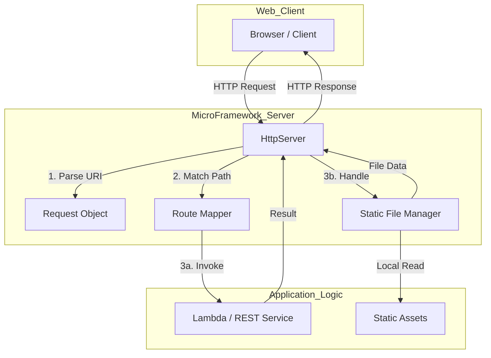
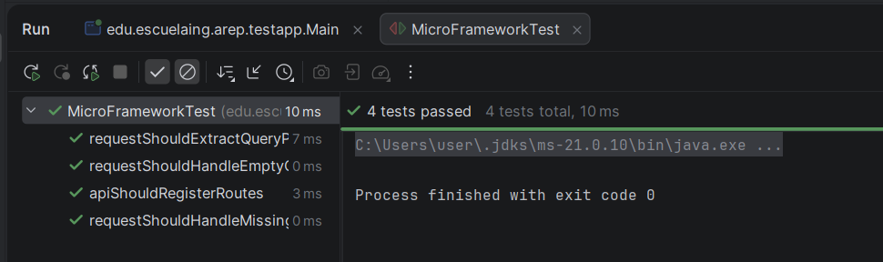
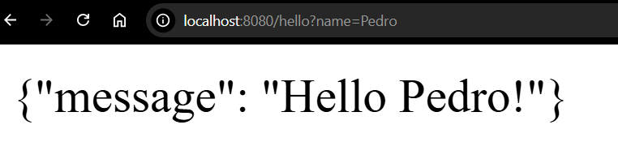
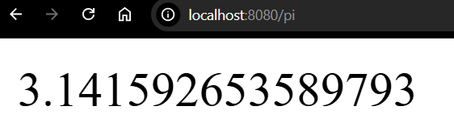
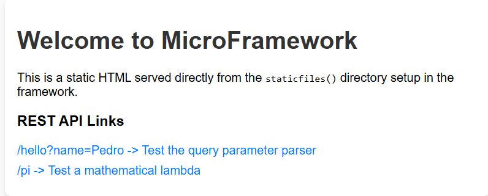

# AREP-MicroFramework-Web


> A lightweight, fully functional web microframework developed in Java for serving RESTful services and static resources.

---

## Table of Contents

- [Overview](#overview)
- [Architecture](#architecture)
- [Project Structure](#project-structure)
- [Getting Started](#getting-started)
  - [Prerequisites](#prerequisites)
  - [Installation](#installation)
  - [Execution](#execution)
- [Features](#features)
- [Testing](#testing)
- [Evaluation Rubric](#evaluation-rubric)
- [Author](#author)

---

## Overview

This project focuses on the development of a web microframework from scratch. It extends a basic web server to support:

1. **REST Services**: Defining routes using lambda functions (e.g., `get("/path", (req, res) -> ...)`).
2. **Query Parameter Management**: Extracting values from the request URL.
3. **Static File Serving**: Configuring a specific directory for static assets (HTML, JS, CSS, images).

The objective is to understand the underlying architecture of web protocols (HTTP), distributed applications, and the internet.

---

## Architecture

The Microframework uses a simple and robust architecture:

### Architecture Diagram



### Components

- **Web Server Core (`HttpServer`)**: Handles socket connection lifecycle, listening on ports for incoming HTTP requests and forwarding them for processing.
- **Request/Response Wrappers (`Request`, `Response`)**: Abstractions for HTTP syntax. The `Request` class seamlessly parses the URL path and decodes the Query String map parameters instantly.
- **MicroFramework API (`MicroFramework`)**: Provides static syntactic sugar for the developer (`get()`, `staticfiles()`). It utilizes a Singleton pattern behind the scenes to access the Server instance.
- **Static File Manager**: Searches specified folders `target/classes/<dir>/` and `src/main/resources/<dir>/` for valid binary and text artifacts and serves them with valid `Content-Type` headers.
- **Microservice Logic (`Route`)**: A functional lambda interface serving as the API bridge where business logic is executed.

---

## Project Structure

```text
/
├── pom.xml
├── README.md
├── src/
│   ├── main/
│   │   ├── java/
│   │   │   └── edu/escuelaing/arep/
│   │   │       ├── MicroFramework.java
│   │   │       ├── server/
│   │   │       │   ├── HttpServer.java
│   │   │       │   ├── Request.java
│   │   │       │   ├── Response.java
│   │   │       │   └── Route.java
│   │   │       └── testapp/
│   │   │           └── Main.java
│   │   └── resources/
│   │       └── webroot/
│   │           └── index.html
│   └── test/
│       └── java/
│           └── edu/escuelaing/arep/
│               └── MicroFrameworkTest.java
```

---

## Getting Started

### Prerequisites

- **Java SDK 17+**
- **Apache Maven 3+**

<details>
<summary>Installation and Execution Guide</summary>

### Installation

```bash
# Clone the repository
git clone https://github.com/USER/AREP-MicroFramework-Web.git

# Navigate to the project directory
cd AREP-MicroFramework-Web

# Build the project
mvn clean install
```

### Execution

```bash
# Run the application
java -cp "target/classes;target/dependency/*" edu.escuelaing.arep.testapp.Main
```

</details>

---

## Features

- [x] **lambda-based REST services**: via the `get()` method.
- [x] **Query parameters**: accessible through the request object.
- [x] **Static file location**: configurable via `staticfiles()`.
- [x] **Professional structure**: Maven-compatible layout.

---

## Testing

### Automated Tests

The project contains unit tests constructed around `JUnit 4`. These assert that the query parser accurately builds hash maps out of URI query strings and properly routes API assignments.

> [!TIP]
> **Screenshot Placeholder**: Insert a terminal screenshot showing the final `BUILD SUCCESS` from the `mvn clean test` command.
> 

Run the tests using Maven:

```bash
mvn clean test
```

_Expected output: All tests parse without failures (0 Failures, 0 Errors)._ Evidence:

```text
[INFO] Running edu.escuelaing.arep.MicroFrameworkTest
[INFO] Tests run: 4, Failures: 0, Errors: 0, Skipped: 0, Time elapsed: 0.054 s - in edu.escuelaing.arep.MicroFrameworkTest
[INFO]
[INFO] Results:
[INFO]
[INFO] Tests run: 4, Failures: 0, Errors: 0, Skipped: 0
[INFO] ------------------------------------------------------------------------
[INFO] BUILD SUCCESS
```

### Manual Testing

The application can be verified manually by navigating to the following endpoints while the server is running:

- **REST Service with Parameters**: `http://localhost:8080/App/hello?name=User`

> [!NOTE]
> **Screenshot Placeholder**: Browser screenshot of the hello service.
> 

- **Mathematical Service (PI)**: `http://localhost:8080/pi`

> [!NOTE]
>
> **Screenshot Placeholder**: Browser screenshot showing the value of PI.
> 

- **Static Content**: `http://localhost:8080/index.html`

> [!NOTE]
> **Screenshot Placeholder**: Browser screenshot showing the rendered HTML page with CSS.
> 

---

## Evaluation Rubric

<details>
<summary>View Rubric</summary>

| Reference Criterion                                 | Points |
| :-------------------------------------------------- | :----: |
| **Deliverables**                                    | **7**  |
| Deployed on GitHub                                  |   1    |
| Complete .gitignore file                            |   1    |
| Has README.md                                       |   1    |
| Contains no unnecessary files or folders            |   1    |
| Has a POM.xml                                       |   1    |
| Respects Maven structure                            |   1    |
| Does not contain the target folder                  |   1    |
| **Design and Architecture**                         | **35** |
| Implement a `get()` method with lambda functions    |   3    |
| Mechanism to extract query parameters               |   3    |
| Introduce a `staticfiles()` method                  |   3    |
| Meets all other functional requirements             |   3    |
| Meets quality attributes                            |   5    |
| System design seems reasonable for the problem      |   3    |
| Design is well documented in the README.md          |   3    |
| README contains installation and usage instructions |   3    |
| README shows evidence of tests                      |   3    |
| Has automated tests                                 |   3    |
| Repository can be cloned and executed               |   3    |
| **Total**                                           | **42** |

</details>

---

## Author

**Sergio Andrey Silva Rodriguez**  
_Systems Engineering Student_  
Escuela Colombiana de Ingeniería Julio Garavito

---

<details>
<summary>License</summary>

This project is for educational purposes as part of the AREP course at Escuela Colombiana de Ingeniería Julio Garavito.

</details>
